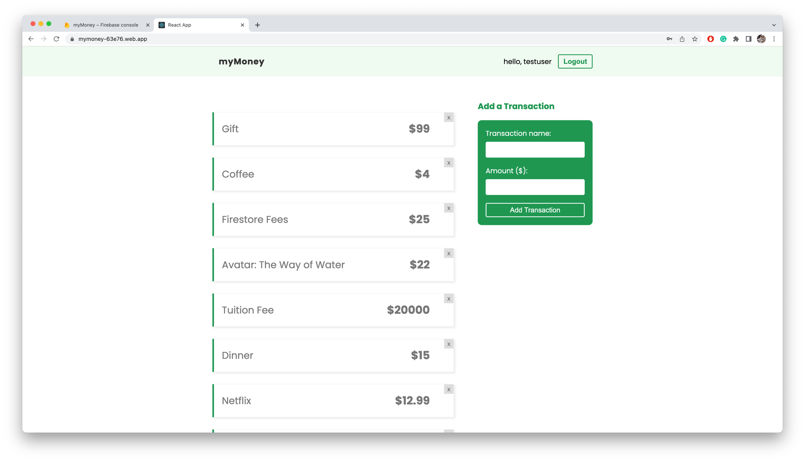

# My Money
Open [https://mymoney-63e76.web.app/login](https://mymoney-63e76.web.app/login) to view it in your browser.

This project was bootstrapped with
* FrontEnd - React
* BackEnd - Firebase
    * fetch/add/delete data
## Project Setup

In the project directory, you can run:


```
npm install
npm install react-router-dom
npm install firebase@8.5
npm start
```

Runs the app in the development mode.\
Open [http://localhost:3000](http://localhost:3000) to view it in your browser.


## Feature
1. Firebase Auth to control user login and signup. Control user sign-in method and store user info

3. FireBase Hosting to deploy App and manage domain/usage

4. React-Dom-Router Redirect provides authentication mechanism to use for someone who is not logged in and redirect to specific page
5. CRUD user transactions and store in the firebase

6. Adding cleanup functions when user goes to another url
7. it includes 
   8. all the basic functions that react must master useContext, useEffect, useState, useRef, useReducer, custom hook 
   9. firebase's CURD, app deployment, interceptors, firebase database...etc